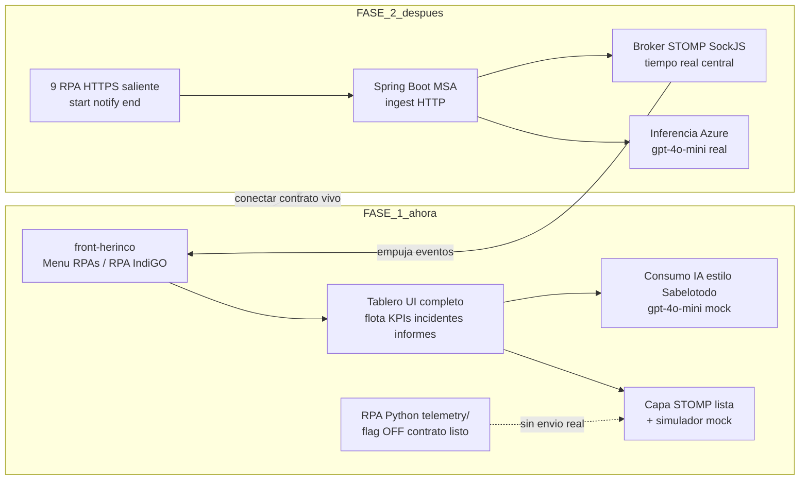
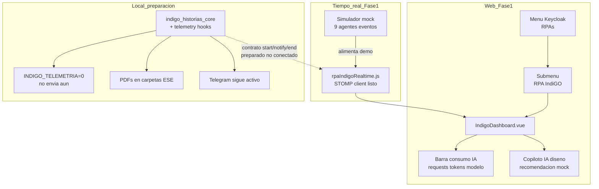
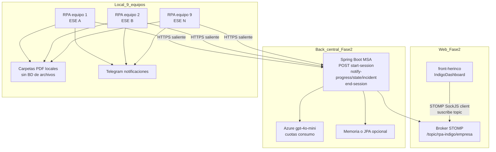

# Plan: Tablero de control RPA IndiGO (front-herinco + telemetría)

## Decisiones cerradas (sin alternativas abiertas)

| Decisión | Elección |
|----------|----------|
| Conectividad | Asumir equipos remotos/NAT: **solo HTTPS saliente** desde cada PC |
| ¿Socket.IO en cada RPA? | **No.** Descartado |
| Tiempo real | Vive en el **back central**, no en el agente |
| Protocolo front-herinco | **STOMP + SockJS** (ya existe en el repo; compatible con Spring Boot). Cumple el mismo rol que Socket.IO en el servidor de `RpaExtraccionZipCorreoSesiones` |
| Agente IndiGO | Cliente HTTP fire-and-forget (como el Java), no servidor |
| PDFs / BD | PDFs siguen en carpetas locales; Fase 1 sin entities; Fase 2 BD solo si se necesita historial |
| Telegram | Se mantiene y mejora desde el RPA; no sustituye el tablero |

## Veredicto sobre tu hipótesis del dibujo

La idea “front como client + tiempo real + 9 equipos + PDFs locales + Telegram” es correcta en intención. Lo que no escala es poner el **signaling server en cada PC**. La versión ganadora es la del RPA Java: el agente **empuja** eventos; el **servidor** los retransmite al dashboard.

## Esquema visual de las 2 fases

### Vista comparativa (qué se construye en cada fase)



### FASE 1 — Solo front + contrato (sin back vivo)



**Qué entrega Fase 1:** tablero usable para monitorizar/evaluar en demo; controles remotos en UI deshabilitados o mock; sin Socket.IO en PCs; sin Spring Boot obligatorio.

### FASE 2 — Back Spring Boot + 9 RPA en vivo



**Qué entrega Fase 2:** eventos reales de caídas, standby, descargas y progreso en el tablero; mismo patrón que `RpaExtraccionZipCorreoSesiones` (HTTP saliente + push en servidor).

### Flujo de ciclo de vida (equivalente Java)

```text
start-session
  → notify-progress / notify-state / notify-incident / notify-download
  → end-session
```

El front **nunca** abre conexiones a IP de los PCs. Cada RPA solo necesita Internet saliente. No hay Socket.IO/signaling server en cada equipo.

## Fase 1 — Solo front-herinco (tablero + diseño + contrato)

Objetivo: menú, vista de monitoreo/control/evaluación, panel de consumo IA, y capa cliente lista para el broker. Sin depender aún del Spring Boot real: mock + contrato de eventos.

### 1.1 Menú y rutas (patrón Tools)

Archivos a tocar/crear en [`front-herinco`](C:\Users\jzapata\Documents\code\HERINCO\front-herinco):

- [`src/App.vue`](C:\Users\jzapata\Documents\code\HERINCO\front-herinco\src\App.vue): ítem menú **RPAs**
- [`src/router/role.js`](C:\Users\jzapata\Documents\code\HERINCO\front-herinco\src\router\role.js): `RPAs`, `RPA_Indigo`
- [`src/router/index.js`](C:\Users\jzapata\Documents\code\HERINCO\front-herinco\src\router\index.js): spread `rpaRoutes`
- Nuevo módulo:
  - `src/views/modules/rpa/RPA.vue` (patrón [`Tools.vue`](C:\Users\jzapata\Documents\code\HERINCO\front-herinco\src\views\modules\tools\Tools.vue) + `SubMenu`)
  - `src/views/modules/rpa/rpa.routes.js`
  - `src/views/modules/rpa/indigo/IndigoDashboard.vue`
  - `src/views/modules/rpa/indigo/routes/indigo.routes.js`

### 1.2 Tablero alineado a cuellos de botella

Vista única `IndigoDashboard.vue` (Vuetify 2, estilo dashboards existentes) con bloques:

1. **Flota (9 equipos):** estado `OFFLINE/READY/RUNNING/STANDBY/RECOVERING/WAITING_PRINT/ERROR`, E.S.E., heartbeat, versión `INDIGO_CORE_BUILD`
2. **Ejecución en vivo:** total / procesadas / pendientes / OK / SIN_HISTORIAS / fallos; paso actual
3. **Incidentes:** `INTERFAZ_CAIDA`, sesión expirada, `ESPERA_IMPRESION`, fallos de plantilla, reintentos, MTTR
4. **Standby / reanudación:** login, relogin, reanudar con sesión abierta
5. **Informe de estado del proceso** (export CSV/PDF UI)
6. **Informe de descargas** (conteos/tamaños verificados; sin abrir PDFs remotos)
7. **Copiloto IA (diseño):** diagnóstico estructurado + aprobación futura (Fase 2+)
8. **Consumo IA:** barra inspirada en [`JobCopilotAiUsageBar.vue`](C:\Users\jzapata\Downloads\proyectos\realDB Geo-Event Bus - P2L - routing y tarifas\refactorii P2L - uber-like - multi tenant BAAS n-1-n\src\components\JobCopilotAiUsageBar.vue) / panel de [`SabelotodoJuniorView.vue`](C:\Users\jzapata\Downloads\proyectos\realDB Geo-Event Bus - P2L - routing y tarifas\refactorii P2L - uber-like - multi tenant BAAS n-1-n\src\views\SabelotodoJuniorView.vue) — requests/cupo, tokens up/down, modelo `gpt-4o-mini`, warn/danger — adaptada a Vue2/Vuetify (port visual, no import directo del repo P2L)

Controles remotos en Fase 1: **UI deshabilitada o mock** (`pause`, `resume`, `relogin`, `stop`) — no se envían a equipos hasta Fase 2 con auth + ACK.

### 1.3 Capa de tiempo real en el front

- Servicio `src/services/rpaIndigoRealtime.js` siguiendo el patrón de [`Formulas.vue`](C:\Users\jzapata\Documents\code\HERINCO\front-herinco\src\views\modules\expediente\formulas\Formulas.vue) (SockJS + Stomp, `connect` / `subscribe` / `beforeDestroy`)
- Env: `VUE_APP_WS_RPA_INDIGO_LOCAL|DEV|TEST|PROD`
- Topics previstos: `/topic/rpa-indigo/{idEmpresa}`, eventos tipados
- Fase 1: si no hay broker, modo **mock simulator** (intervalos) para demo del tablero

### 1.4 Contrato de eventos (compartido mentalmente con el RPA)

Payloads sanitizados (sin cédula en claro):

- `agent.started` / `agent.heartbeat` / `agent.ready`
- `run.started` / `run.completed` / `run.stopped`
- `patient.completed` (`result`, `duration_ms`, `pdf.verified`)
- `incident.opened` / `recovery.*` (`INTERFAZ_CAIDA`, `ESPERA_IMPRESION`, …)
- `ai.usage` / `ai.recommendation` (cuando exista copiloto)

### 1.5 Instrumentación mínima en este workspace RPA (preparación, no broker)

En [`indigo_historias_core.py`](C:\Users\jzapata\Desktop\H40-4117 RPA Indigo descarga historias MEDICI\indigo_historias_core.py):

- Módulo `telemetry/` con outbox + `POST` opcional (flag `INDIGO_TELEMETRIA_HABILITADA=0` por defecto)
- Hooks en arranque, `_escribir_fila_resultado()`, standby/caída, cierre
- Mismo ciclo que Java: `start-session` → `notify-*` → `end-session`
- No abre puertos; no Socket.IO local

## Fase 2 — Microservicio Spring Boot

- MSA detrás del gateway Herinco (~8771): ingest HTTP + broker STOMP
- Endpoints alineados al Java: `start-session`, `notify-progress/state/incident`, `execution-results`, `end-session`
- Auth agente: API key / token por instalación
- Auth front: Keycloak + `idEmpresa` (como el resto de Herinco)
- Broadcast a `/topic/rpa-indigo/{idEmpresa}`
- Entities JPA: solo si se exige historial/informes; si no, proyección en memoria + log
- Inferencia `gpt-4o-mini` vía API Azure (patrón `qaCopilotAzureGpt.js`) llamada **desde el back**, nunca desde el navegador; el front solo muestra consumo y recomendaciones

## Esquema de tiempos (estimación para la tarea)

| Fase | Entregable | Esfuerzo |
|------|------------|----------|
| **1.0** | Roles, menú RPAs, rutas, shell `RPA.vue` | **0.5 día** |
| **1.1** | `IndigoDashboard.vue` flota + KPIs + incidentes + standby (UI + mock) | **2–2.5 días** |
| **1.2** | Informes UI estado/descargas + export | **1 día** |
| **1.3** | Panel consumo IA + bloque copiloto (diseño/port) | **1–1.5 días** |
| **1.4** | Servicio STOMP + env + modo mock/live | **1 día** |
| **1.5** | Contrato eventos + hooks telemetría en RPA Python (flag off) | **1–1.5 días** |
| **Subtotal Fase 1** | Tablero usable en demo + contrato listo | **~7–8 días hábiles** |
| **2.0** | MSA Spring Boot ingest + STOMP + auth agente | **3–4 días** |
| **2.1** | Integración 1 equipo piloto end-to-end | **1.5–2 días** |
| **2.2** | Informes server-side + uso IA real + cuotas | **2–3 días** |
| **2.3** | Expansión a 9 equipos + endureza | **2 días** |
| **Subtotal Fase 2** | Tiempo real productivo | **~8.5–11 días hábiles** |
| **Total** | | **~15–19 días hábiles** (~3–4 semanas) |

Orden de entrega sugerido para la tarea: **cerrar Fase 1 completa antes de abrir Fase 2**.

## Criterios de aceptación Fase 1

- Menú **RPAs → RPA IndiGO** visible con rol Keycloak
- Tablero muestra 9 slots de agente, KPIs, incidentes, standby, informes UI
- Barra de consumo IA visible (mock o datos de demo)
- Servicio realtime conecta o cae a mock sin romper la vista
- Ningún secreto Azure/Mongo en el front
- RPA sigue operando si telemetría está apagada

## Criterios de aceptación Fase 2

- Un RPA emite eventos y el tablero los refleja en < ~3–5 s
- Caída IndiGO / standby / descarga generan eventos tipados
- Sin puertos abiertos en los PCs
- PDFs no salen del equipo
- Cédulas no viajan en claro al front

## Fuera de alcance inmediato

- Autonomía IA ejecutando clics sin aprobación
- Socket.IO server por equipo
- GitHub Pages como plano de datos
- Sustituir CSV local de reanudación
- Comandos remotos productivos sin ACK/auditoría
