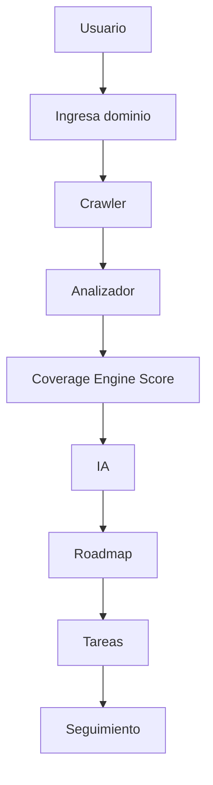

# Confirmación de dirección: SEO Coverage Engine

## Respuesta corta

**Sí, esa es exactamente la dirección del producto.** El flujo que describes es el roadmap correcto:

Hoy (Fase 1 MVP) cubrimos **hasta Coverage Engine + hallazgos**. IA / roadmap / tareas / seguimiento son **Fases 3–4** (aún no construidas), tal como acordamos en la estrategia.

---

## Qué ya permite el sistema

| Capacidad | Estado |
|-----------|--------|
| Auditar **cualquier dominio** (API `POST /domains` con `baseUrl`) | Listo en backend |
| Seed piloto `www.refactorii.com` al crear company | Listo |
| Crawler (sitemap + BFS, cap URLs) | Listo |
| Analizadores (meta, canonical, H1, alt, schema, OG, HTTP, robots…) | Listo |
| **Coverage Score MVP** alineado a tu tarjeta | Ya en [`seoScoreService.js`](modelos_back/services/seoScoreService.js) |
| Import CSV GSC | Listo (`import-gsc` + botón en dashboard) |
| Dashboard KPI + hallazgos + historial | Listo |
| Multi-tenant white-label / SaaS vendible | Estructura lista; ePayco/planes = Fase 3 |

### Score MVP (como en tu imagen)

Pesos actuales en código:

- 20% URLs en sitemap  
- 20% meta title válido  
- 20% meta description válida  
- 15% canonical correcto  
- 15% H1 presente  
- 10% imágenes con alt  

Total 100 pts → un número útil de dashboard **sin IA**.

---

## Matiz importante: dominio vs URL suelta

- El diseño correcto (y el que tienes) es: el usuario ingresa un **dominio / sitio** (`https://ejemplo.com`), el crawler descubre muchas URLs, y el score es **agregado del sitio**.
- No es un “pega una sola URL y listo” como Lighthouse de una página (aunque se puede añadir modo “auditar 1 URL” después).
- En la UI de Fase 1 el dominio se **siembra** a refactorii.com; falta un input visible “Agregar / cambiar dominio” (el API ya lo soporta). Eso es el siguiente ajuste UX, no un cambio de arquitectura.

---

## Cómo encaja GSC + IA en el pipeline

1. **Ahora:** crawler + analyzers → Coverage Score + findings; CSV GSC marca URLs “vistas en Search Console” y permite diff sitemap/crawl/índice (Fase 2).
2. **Después (IA):** sobre findings + score → generar **roadmap priorizado** y **tareas accionables** (ej. “añadir H1 en /blog/x”, “completar alt en N imágenes”, “incluir URL en sitemap”).
3. **Seguimiento:** re-auditorías periódicas + histórico de score (comparar jul vs ago) para cerrar el loop.

Eso convierte el análisis en **producto SaaS**: no solo un informe puntual, sino motor continuo de mejoras.

---

## Qué NO es aún (para no confundir expectativas)

- No hay agente que escriba código/commits solo.
- No hay Search Console API OAuth (solo CSV).
- No hay CWV real (placeholder).
- No hay UI de “tareas” ni “roadmap” persistente.
- No hay ePayco / planes de venta todavía.

---

## Conclusión

Estamos en la dirección correcta para:

1. Analizar SEO de **cualquier sitio** que el usuario registre.  
2. Mostrar un **Coverage Score MVP** útil (tu tarjeta).  
3. Enriquecer con **informe GSC**.  
4. Evolucionar a **IA → roadmap → tareas → seguimiento** como oferta SaaS.

**Siguiente paso recomendado al continuar:** pulir la UI para “ingresar dominio” + tarjeta visual Coverage Score MVP (6 barras) + prioridad de hallazgos estilo ingeniero SEO; luego Fase 2 (diff GSC) y Fase 3 (IA + tareas).
