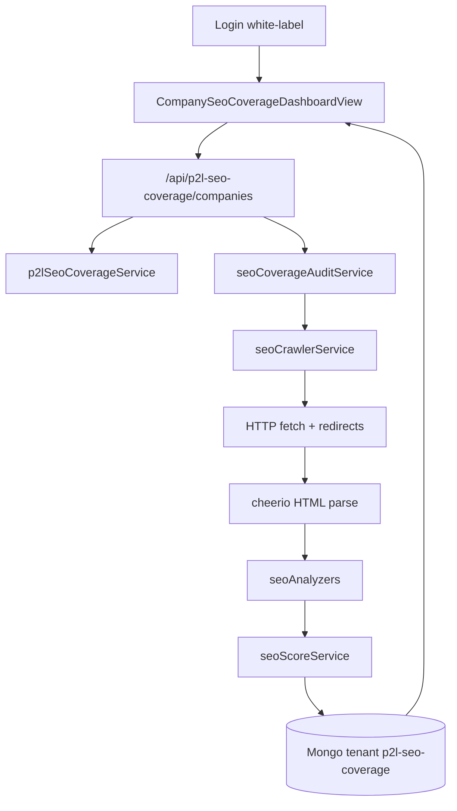

# SEO Coverage Engine — Fase 1 MVP

## Decisión de alcance

MVP completo (backend + dashboard Vue + seed `www.refactorii.com`).  
Stack: **Node/Express + Mongoose + cheerio + Vue 3/Vuetify**, no Spring/Java.  
Fuera de Fase 1: ePayco, AI suggests, Search Console API, CWV real, scheduler productivo.

Base de diseño: [ESTRATEGIA-SEO-COVERAGE-ENGINE.md](Google Search Console - 20260712/ESTRATEGIA-SEO-COVERAGE-ENGINE.md).

## Arquitectura del flujo



## 1. Tenant y configuración

- Añadir `p2l-seo-coverage` en [modelos_back/tenants/tenants.config.js](modelos_back/tenants/tenants.config.js) (mismo shape que `p2l-qa-copilot`).
- Env en `.env.example` / `modelos_back/.env.example`:
  - `P2L_TENANT_P2L_SEO_COVERAGE_API_KEY`
  - `P2L_TENANT_P2L_SEO_COVERAGE_MONGODB` (default `p2l_seo_coverage`)
- Dependencia: `cheerio` en `modelos_back/package.json` (HTML parse estable; el job fetcher actual usa regex, insuficiente para schema/OG).

## 2. Modelo de datos Mongo

Archivo nuevo: [modelos_back/db/seoCoverageModels.js](modelos_back/db/seoCoverageModels.js) — patrón `getXyzModels(db)` + cache como [rpaDashboardModels.js](modelos_back/db/rpaDashboardModels.js).

Entidades Fase 1:

| Modelo | Campos clave |
|--------|----------------|
| `SeoCompany` | adminEmail, name, plan stub |
| `SeoDomain` | companyId, host, baseUrl, sitemapUrl, maxUrls (default 200) |
| `SeoAuditRun` | domainId, status (`queued|running|done|failed`), scores, counts, error |
| `SeoUrlSnapshot` | runId, url, finalUrl, statusCode, redirectChain, signals (meta, canonical, og, schema, headings, alts, links) |
| `SeoFinding` | runId, urlSnapshotId, dimension, severity, code, message, evidence |
| `SeoScoreSnapshot` | runId, overall, dimensions{} |

## 3. Servicios de análisis

```
modelos_back/services/
  p2lSeoCoverageService.js       # company/domain CRUD, getTenantDb
  seoCoverageAuditService.js     # orquesta run
  seoCrawlerService.js           # sitemap + BFS interno cap N
  seoScoreService.js             # pesos de la estrategia
  seoAnalyzers/
    metaAnalyzer.js
    canonicalAnalyzer.js
    schemaAnalyzer.js
    openGraphAnalyzer.js
    headingsAnalyzer.js
    imagesAltAnalyzer.js
    internalLinksAnalyzer.js
    httpAnalyzer.js
    robotsAnalyzer.js
    sitemapAnalyzer.js
```

Comportamiento crawler:
- Seed: `baseUrl` + `sitemap.xml` (+ sitemap local de la carpeta GSC como fallback de seeds si el remoto falla).
- Cap: 200 URLs/run (config en Domain).
- Fetch con timeout, follow redirects (máx 5), User-Agent de bot legítimo.
- Analyzers emiten findings con `severity: critical|warning|opportunity|info`.
- CWV: dimensión fija placeholder (score 50 / finding info “not measured”).

## 4. API REST

Archivo: [modelos_back/routes/p2lSeoCoverageRoutes.js](modelos_back/routes/p2lSeoCoverageRoutes.js)  
Auth: mismo Bearer Google que RPA/QA (`verifyBearerGetEmail`).

Endpoints Fase 1:
- `GET/POST /me` y create company
- `GET/POST /domains` (seed automático de `https://www.refactorii.com` al crear company si no hay dominios)
- `POST /domains/:id/audits` — inicia run (async in-process; responde `runId`)
- `GET /domains/:id/audits`
- `GET /audits/:runId` — score + resumen
- `GET /audits/:runId/findings?severity=&dimension=`
- `GET /audits/:runId/urls`
- `POST /domains/:id/import-gsc` — parse CSV Coverage (Tabla.csv) y marca URLs “seen in GSC”

Mount en [modelos_back/server.js](modelos_back/server.js):
`app.use('/api/p2l-seo-coverage/companies', createP2lSeoCoverageRoutes(svc))`

## 5. Frontend white-label

- Router ([src/router/index.js](src/router/index.js)):
  - `/login/seo-coverage-dashboard` → `whiteLabel: 'seo-coverage'`, `postLoginPath: '/seo-coverage-dashboard'`
  - `/seo-coverage-dashboard` → `tenantId: 'p2l-seo-coverage'`
  - redirects `/p2l-tenant/...`
- [src/views/Login.vue](src/views/Login.vue): branding mínimo (título SEO Coverage Engine, color teal/azul distinto de Job Copilot).
- [src/api/p2lSeoCoverageApi.js](src/api/p2lSeoCoverageApi.js)
- [src/views/CompanySeoCoverageDashboardView.vue](src/views/CompanySeoCoverageDashboardView.vue) con `CompanyDashHero`:
  - KPI: Coverage Score, URLs analizadas, críticos, oportunidades
  - Botón “Iniciar auditoría”
  - Tabla findings priorizados
  - Lista runs históricos
  - Sin accordion de planes/ePayco en Fase 1

## 6. Tracking en carpeta GSC

- Crear `Google Search Console - 20260712/estado/2026-07-12/` con README de baseline (apunta a CSV/sitemap existentes).
- Actualizar la estrategia marcando Fase 1 “en curso” (solo ese doc).

## 7. Criterio de done

1. Login → dashboard crea company + domain `www.refactorii.com`.
2. Un audit run completa y muestra score + findings.
3. Al menos home, `/ai-first-development/`, blogs P2L ES/EN aparecen en URLs si están en sitemap/crawl.
4. Findings de meta/canonical/H1/alt/HTTP visibles en tabla.
5. Build Vite OK; backend arranca sin error de módulo.

## Orden de implementación

1. Tenant + models + cheerio  
2. Analyzers + crawler + score  
3. Service + routes + server mount  
4. API front + router + login + dashboard  
5. Smoke manual: una auditoría contra refactorii.com  
