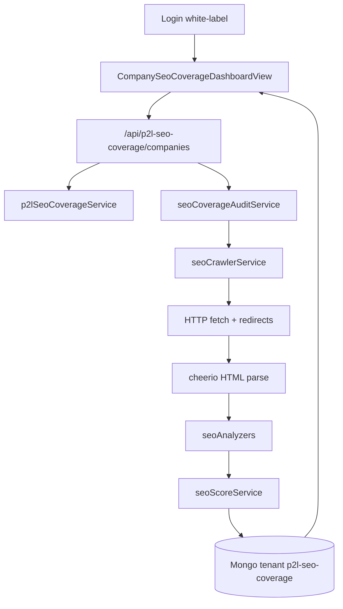

# SEO Coverage Engine — Fase 1 MVP (implementado)

## Estado

**DONE** — entregado en el monorepo P2L multi-tenant BAAS.

## Decisión de alcance

MVP completo (backend + dashboard Vue + seed `www.refactorii.com`).  
Stack: **Node/Express + Mongoose + cheerio + Vue 3**, no Spring/Java.  
Fuera de Fase 1 (luego Fase 2–3): ePayco packs finales, AI roadmap, Search Console OAuth, CWV real.

## Arquitectura del flujo

## Entregables implementados

### 1. Tenant y configuración

- Tenant `p2l-seo-coverage` en `modelos_back/tenants/tenants.config.js`
- Env: `P2L_TENANT_P2L_SEO_COVERAGE_API_KEY`, `P2L_TENANT_P2L_SEO_COVERAGE_MONGODB`
- Front: `VITE_P2L_TENANT_P2L_SEO_COVERAGE_API_KEY`
- Dependencia: `cheerio@0.22.0` (compatible Node antiguo en VPS)

### 2. Modelos Mongo (`seoCoverageModels.js`)

| Modelo | Uso |
|--------|-----|
| `SeoCompany` | adminEmail, plan, créditos |
| `SeoDomain` | host, baseUrl, sitemapUrl, maxUrls, gscUrls |
| `SeoAuditRun` | status, scores, counts, coverageDiff |
| `SeoUrlSnapshot` | signals por URL |
| `SeoFinding` | dimension, severity, code, message |
| `SeoScoreSnapshot` | overall + dimensions |

### 3. Servicios

- `p2lSeoCoverageService.js` — company/domain CRUD
- `seoCoverageAuditService.js` — orquesta run
- `seoCrawlerService.js` — sitemap + BFS cap N
- `seoScoreService.js` — pesos MVP
- Analyzers: meta, canonical, schema, OG, headings, alt, links, HTTP, robots, sitemap

### 4. API REST

Montaje: `/api/p2l-seo-coverage/companies`

- Crear company / `GET me`
- Domains CRUD
- `POST .../audits` → run async
- Findings / URLs / import GSC CSV

### 5. Frontend white-label

- Login: `/login/seo-coverage-dashboard/:locale(es|en)`
- Dashboard: `/seo-coverage-dashboard`
- `CompanyDashHero` theme `seo-coverage`
- KPI Coverage Score + hallazgos + historial de runs

## Criterio de done (cumplido)

1. Login → company + dominio
2. Audit run completa con score + findings
3. Import CSV GSC básico
4. Persistencia solo Mongo tenant

## Archivos clave

- `modelos_back/db/seoCoverageModels.js`
- `modelos_back/services/p2lSeoCoverageService.js`
- `modelos_back/services/seoCoverageAuditService.js`
- `modelos_back/routes/p2lSeoCoverageRoutes.js`
- `src/views/CompanySeoCoverageDashboardView.vue`
- `src/api/p2lSeoCoverageApi.js`
