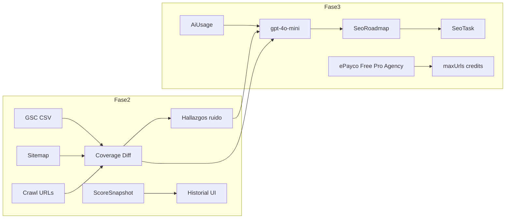

=# Plan: SEO Coverage Engine — Fases 2 y 3

## Contexto

Fase 1 ya entrega: dominio → crawl → analyzers → Coverage Score MVP + hallazgos + import CSV GSC (solo `gscUrls` + flag `inGsc`). **Sin Postgres.** Persistencia solo en Mongo tenant `p2l-seo-coverage`.

Hoy **no** hay: diff de cobertura, roadmap IA, tareas persistentes, cupos ni ePayco.

---

## Fase 2 — Cobertura GSC + calidad de datos

### 2.1 Servicio de diff (núcleo)

Nuevo [`modelos_back/services/seoCoverageDiffService.js`](modelos_back/services/seoCoverageDiffService.js):

- Normalizar URL (host lowercase, strip trailing `/`, opcional drop `#`).
- Tres sets por dominio/run:
  - `gsc` ← `SeoDomain.gscUrls`
  - `sitemap` ← discovery del run o re-fetch sitemap del dominio
  - `crawl` ← `SeoUrlSnapshot` del `runId` (o último `done`)
- Buckets:
  - `gscOnly` / `sitemapOnly` / `crawlOnly`
  - `gscAndSitemap` / `inAllThree`
  - `gscNotInSitemap`, `sitemapNotInGsc`, `crawlNotInGsc`
- Ruido SEO (mismas URLs canónicas distintas):
  - www vs non-www
  - `.html` vs pretty
  - query `lang` / `hl` / duplicados path

Persistir resultado en el run: `SeoAuditRun.coverageDiff` (Mixed) al final de la auditoría **y** endpoint on-demand.

### 2.2 Hallazgos + prioridad

- Extender [`seoScoreService.js`](modelos_back/services/seoScoreService.js) `buildPrioritySummary` con items GSC (`GSC_NOT_IN_SITEMAP`, `SITEMAP_NOT_IN_GSC`, `DUPLICATE_WWW`, etc.).
- Nuevo analyzer ligero [`seoAnalyzers/gscCoverageAnalyzer.js`](modelos_back/services/seoAnalyzers/gscCoverageAnalyzer.js) que, post-crawl (o en `executeAuditRun`), emita findings agregados (no 1 por URL si el set es enorme: top N + counts).
- En [`seoCoverageAuditService.js`](modelos_back/services/seoCoverageAuditService.js): tras flush Mongo, llamar `computeCoverageDiff` y guardar en el run.

### 2.3 Import GSC más útil

En [`p2lSeoCoverageService.js`](modelos_back/services/p2lSeoCoverageService.js) `importGsc`:

- Guardar también `gscImportedAt` en domain.
- Aceptar CSVs tipo Coverage Valid (primera columna URL; skip header).
- Opcional: modelo `SeoGscImport` (companyId, domainId, importedAt, urlCount, sampleUrls) para historial — **sí incluir** (1 doc por import, max 20 retenidos).

### 2.4 API

En [`p2lSeoCoverageRoutes.js`](modelos_back/routes/p2lSeoCoverageRoutes.js):

- `GET /domains/:domainId/coverage-diff?runId=` → resumen buckets + counts + samples (máx ~50 URLs/bucket).
- Incluir `coverageDiff` en `sanitizeRun` / `GET /audits/:runId`.

### 2.5 UI Fase 2

En [`CompanySeoCoverageDashboardView.vue`](src/views/CompanySeoCoverageDashboardView.vue):

- Sección **Cobertura GSC**: tarjetas con counts (en GSC / sitemap / crawl / solo-GSC / solo-sitemap) + lista colapsable de samples.
- **Histórico de score**: sparkline o lista de últimos N runs (`overallScore` vs fecha) — datos ya en historial; solo visualización.

**Done Fase 2:** con CSV de la carpeta GSC-20260712 + auditoría, el dashboard muestra el mismo tipo de gaps (indexadas vs sitemap vs crawl) de forma automaticable.

---

## Fase 3 — IA (gpt-4o-mini) + tareas + ePayco

Orden de build: **IA roadmap/tareas → cupos → ePayco/planes → UI**.

### 3.1 Modelos Mongo ([`seoCoverageModels.js`](modelos_back/db/seoCoverageModels.js))

| Modelo | Uso |
|--------|-----|
| `SeoAiRun` | feature (`seo_fix_plan` \| `seo_task_suggest`), input refs (runId), output JSON, rawText |
| `SeoTask` | companyId, domainId, runId, title, description, severity, status (`todo`/`done`), source (`ai`/`manual`), code |
| `SeoAiLedger` | créditos de flujo / pagos (espejo QA) |
| Extender `SeoCompany` | `fullFlowCreditsRemaining`, campos ePayco mínimos ya usados en QA |

### 3.2 Cliente IA

Reutilizar **sin fork** [`qaCopilotAzureGpt.js`](modelos_back/services/qaCopilotAzureGpt.js) (`GH_PAT`, modelo `gpt-4o-mini`).

Nuevo [`seoCoverageAiUsageService.js`](modelos_back/services/seoCoverageAiUsageService.js) (plantilla de `qaCopilotAiUsageService.js`):

- Features: `plan` (roadmap), `suggest` (fix puntual).
- Límites env: `SEO_COVERAGE_AI_DAILY_PLAN_LIMIT`, `SEO_COVERAGE_AI_DAILY_SUGGEST_LIMIT`.
- State file: `modelos_back/state/seo_coverage_ai_usage.json`.

Nuevo [`seoCoverageAiService.js`](modelos_back/services/seoCoverageAiService.js):

1. Cargar run: `prioritySummary` + top findings (cap ~40) + resumen `coverageDiff`.
2. Prompt system → JSON estricto:
   - `roadmap`: semanas/fases con objetivos
   - `tasks`: `[{ title, why, how, severity, code, urlHint }]`
3. `assertQuota` → `chatCompletionJson` → persistir `SeoAiRun` + upsert `SeoTask` (reemplazar tareas `source:ai` abiertas del dominio o versionar por `aiRunId`).
4. Consumir crédito de flujo si aplica (como QA).

### 3.3 API IA / tareas

Prefijo existente `/api/p2l-seo-coverage/companies`:

- `GET /ai/usage`
- `POST /domains/:domainId/ai/roadmap` body `{ runId? }` → genera plan + tareas
- `GET /domains/:domainId/ai/latest-roadmap`
- `GET /domains/:domainId/tasks`
- `PATCH /tasks/:taskId` `{ status }`

### 3.4 ePayco + planes (mismo entregable, después de IA)

Espejo mínimo de [`p2lQaCopilotService.js`](modelos_back/services/p2lQaCopilotService.js) / rutas QA:

| Plan | maxUrls auditoría | Créditos roadmap IA |
|------|-------------------|---------------------|
| Free (0/1) | 50 | 1 |
| Pro | 1000 | N vía pago |
| Agency | 10000 | N vía pago |

- Env scoped: `P_EPAYCO_*_SEO_COVERAGE`, `P2L_PLAN_*_SEO_COVERAGE`
- Rutas: `checkout-config`, `epayco/confirmation`, `epayco/return` montadas en [`server.js`](modelos_back/server.js) como QA
- Al crear audit: respetar `domain.maxUrls` / plan company (ya hay `maxUrls` en domain; setear desde plan)

### 3.5 UI Fase 3

- Botón **Generar plan de mejora (IA)** en dashboard → muestra roadmap + lista de tareas (marcar done).
- Barra de cupos (adaptar patrón [`JobCopilotAiUsageBar.vue`](src/components/JobCopilotAiUsageBar.vue) o componente SEO ligero).
- Accordion planes / checkout ePayco (copiar UX Job Copilot, tema `seo-coverage`).
- API client: extender [`p2lSeoCoverageApi.js`](src/api/p2lSeoCoverageApi.js).

**Done Fase 3:** usuario registra dominio, audita, importa GSC, ve diff, genera roadmap gpt-4o-mini con tareas, y puede comprar plan Pro/Agency vía ePayco.

---

## Fuera de este plan (Fase 4)

GSC OAuth, CWV real, agente que edita HTML/PRs, Redis queues, Telegram.

---

## Archivos principales a tocar

**Fase 2:** `seoCoverageDiffService.js` (nuevo), `seoCoverageModels.js`, `seoCoverageAuditService.js`, `seoScoreService.js`, `p2lSeoCoverageService.js`, `p2lSeoCoverageRoutes.js`, `CompanySeoCoverageDashboardView.vue`, `p2lSeoCoverageApi.js`

**Fase 3:** `seoCoverageAiService.js`, `seoCoverageAiUsageService.js`, modelos + ledger, rutas IA/tareas/ePayco, `server.js`, dashboard + api client, `.env.example` (sin Postgres)
