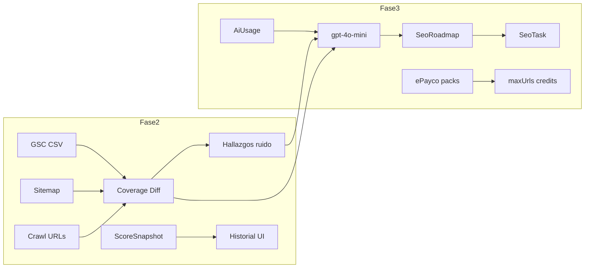

# SEO Coverage Engine — Fases 2 y 3 (implementado)

## Estado

**DONE** — Fase 2 (cobertura) + Fase 3 (IA + planes ePayco base).

---

## Fase 2 — Cobertura GSC + calidad de datos

### Implementado

| Pieza | Archivo / detalle |
|-------|-------------------|
| Diff service | `seoCoverageDiffService.js` — buckets + ruido www/html/lang |
| Persistencia | `SeoAuditRun.coverageDiff` |
| Import history | `SeoGscImport` + `gscImportedAt` |
| API | `GET .../coverage-diff` |
| UI | KPIs GSC/sitemap/crawl + samples + sparkline score |

### Hallazgos de ruido

Códigos tipicos: `GSC_NOT_IN_SITEMAP`, `SITEMAP_NOT_IN_GSC`, duplicados www / `.html` / lang.

---

## Fase 3 — IA + tareas + ePayco

### Implementado

| Pieza | Detalle |
|-------|---------|
| Modelos | `SeoAiRun`, `SeoTask`, `SeoAiLedger` |
| IA | `seoCoverageAiService.js` vía `qaCopilotAzureGpt.js` (gpt-4o-mini) |
| Cupos | `seoCoverageAiUsageService.js` + env `SEO_COVERAGE_AI_DAILY_*` |
| API | usage, roadmap, tasks PATCH, checkout-config |
| ePayco | confirmation/return montados en `server.js` |
| UI | botón generar plan, tareas checkbox, `JobCopilotAiUsageBar` |

### Nota de créditos (post-ajuste)

Tras el refinamiento de packs comerciales:

- **1 crédito = 1 auditoría** (`SeoAuditRun` en historial)
- El roadmap IA usa **cupo diario**, no quema créditos de auditoría
- Packs Free / Plan 1–3 documentados en el plan de productos ePayco

---

## Fuera de alcance (Fase 4+)

GSC OAuth, CWV real, agente que edita HTML/PRs, Redis queues, Telegram.

## Archivos clave

**Fase 2:** `seoCoverageDiffService.js`, `seoCoverageAuditService.js`, dashboard cobertura  

**Fase 3:** `seoCoverageAiService.js`, `seoCoverageAiUsageService.js`, rutas IA/ePayco, dashboard AI + planes
