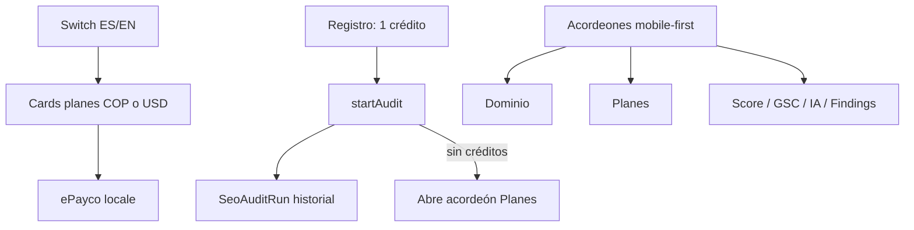

# SEO Coverage Engine — Producto / polish (implementado)

## Objetivo

Dejar el white-label listo para demo y venta: idioma, precios, UX móvil y conexión tenant clara.

---

## 1. i18n ES / EN (patrón Job Copilot)

- Namespace `seo_coverage` en `locales/es.json` + `locales/en.json`
- Login: `/login/seo-coverage-dashboard/es|en` + switch
- Dashboard: textos, métricas MVP, mensajes de error/status
- Checkout: `locale=en` → cobro USD; `es` → COP

---

## 2. Planes ePayco (env front + back)

| Interno | Comercial | Créditos | COP | USD | Notas |
|---------|-----------|----------|-----|-----|-------|
| Plan 1 | Gratis | 1 auditoría | 0 | 0 | al registrarse |
| Plan 2 | Plan 1 | 4 | 80.000 | 21 | pack |
| Plan 3 | Plan 2 | 10 | 160.000 | 42 | pack |
| Plan 4 | Plan 3 | 20 / mes | 300.000 | 79 | `billingDays=30` |

Variables:

- Back: `P2L_PLAN_*_*_SEO_COVERAGE`, `P_EPAYCO_*_SEO_COVERAGE`
- Front: `VITE_P2L_TENANT_P2L_SEO_COVERAGE_API_KEY`, `VITE_P2L_PLAN_*_SEO_COVERAGE`

**Historial:** cada auditoría crea `SeoAuditRun` (ya existía).

**Gate:** `startAudit` consume 1 crédito; 402 `NO_CREDITS` si no hay.

---

## 3. UI mobile-first (acordeones)

Orden:

1. Dominio (abierto por defecto)
2. Planes (compra fácil + hint COP/USD)
3. Coverage Score
4. GSC
5. Histórico score
6. Prioridad
7. Plan IA
8. Hallazgos
9. Historial auditorías

Sin créditos → abre acordeón Planes automáticamente.

---

## 4. Tenant front ↔ back

| Front `.env` | Back `modelos_back/.env` |
|--------------|--------------------------|
| `VITE_P2L_TENANT_P2L_SEO_COVERAGE_API_KEY` | `P2L_TENANT_P2L_SEO_COVERAGE_API_KEY` |
| | `P2L_TENANT_P2L_SEO_COVERAGE_MONGODB=p2l_seo_coverage` |

- Header `x-api-key` en `p2lSeoCoverageApi.js`
- Socket handshake en rutas `/seo-coverage-dashboard`

---

## 5. Visor de planes (GitHub Pages)

Repo: [wbsckt3/seo_coverage_engine](https://github.com/wbsckt3/seo_coverage_engine)  
Pages: [wbsckt3.github.io/seo_coverage_engine](https://wbsckt3.github.io/seo_coverage_engine/)

Local (para publicar): `docs/gh-pages-seo-coverage/`

- `index.html` — selector + vista tipo PDF
- `*.plan.md` — planes de desarrollo guardados aquí

---

## Archivos tocados (resumen)

- `locales/es.json`, `locales/en.json`
- `CompanySeoCoverageDashboardView.vue`
- `Login.vue` / router locale SEO
- `p2lSeoCoverageService.js` (packs + consume audit)
- `.env`, `modelos_back/.env` (+ examples)
- `docs/gh-pages-seo-coverage/*`
