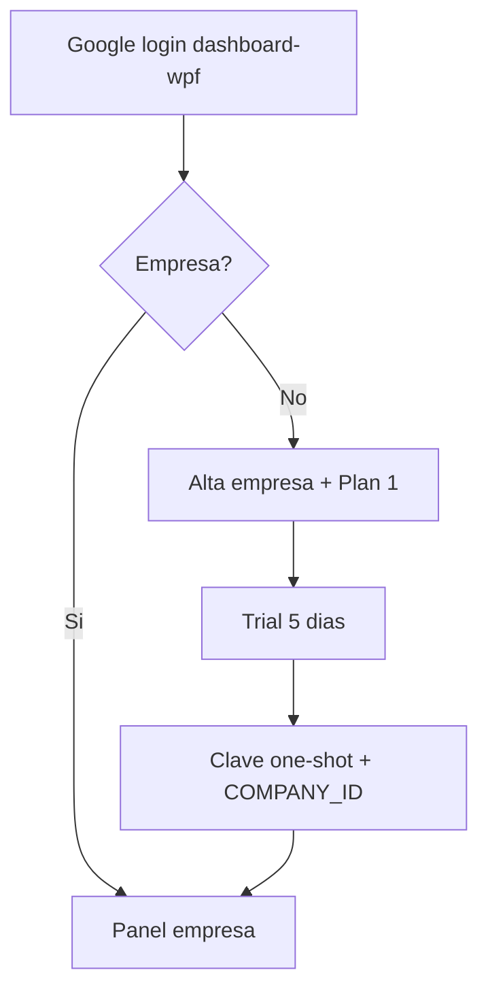

# Dinámica de usuario — WPF Dashboard

White label **P2L Desktop (WPF)**. El panel web no es el mapa AVL: gestiona empresa, licencia, wallet y conductores. El monitoreo vive en el cliente .NET AvlMonitor.

## Rutas y sesión

| Pieza | Valor |
|-------|-------|
| Login | `/login/dashboard-wpf` (`whiteLabel: wpf`) |
| Dashboard | `/dashboard-wpf` → `CompanyWpfDashboardView` |
| Alias | `/p2l-tenant/dashboard-wpf`, `/wpf-dashboard` |
| Tenant | `p2l-wpf` (Mongo / API `/api/p2l-wpf`) |
| Auth | Google — mismo token que el resto de P2L (~1 h) |

URL pública típica: `https://www.refactorii.com/p2l-tenant/login/dashboard-wpf`

## Flujo sin empresa (alta)

1. Admin entra con Google.
2. Completa formulario: nombre, teléfono, responsable, email.
3. Alta inicial forzada a **Plan 1 Starter** (catálogo marketing visible; otros planes en recarga).
4. Aplica **trial 5 días** con cupos del plan (conductores y viajes/día).
5. Backend crea compañía y muestra **clave one-shot** + `P2L_COMPANY_ID`.

## Flujo con empresa

Secciones del scroll (sin tabs):

1. **Banners** — trial activo / trial vencido / necesita ePayco.
2. **Datos empresa** — plan, estado suscripción, viajes hoy vs cupo, wallet (saldo COP, costo/viaje, viajes restantes).
3. **Wallet: recarga tu plan** — cards Starter / Growth / Business / Enterprise → checkout ePayco embebido.
4. **Conductores (correos Google)** — alta/baja de miembros autorizados a entrar al escritorio; uso/viajes por conductor.
5. **Copiar plantilla .env** — genera el bloque para el cliente .NET (`P2L_COMPANY_ID`, `P2L_COMPANY_KEY`, endpoints, etc.).

## Reglas de producto visibles en UI

- La clave de empresa **solo se muestra una vez** tras el alta (canal seguro → `P2L_COMPANY_KEY`).
- Tras el trial, sin pago ePayco el servicio queda inactivo.
- Planes de pago se renuevan ~30 días vía ePayco scoped al tenant WPF.
- Enterprise = contacto ventas (no checkout self-serve).

## Entregables de cobertura

- Vista: `src/views/CompanyWpfDashboardView.vue`
- API client: `src/api/p2lWpfCompanyApi.js`
- Docs origen: carpeta Marco (`Prompt Marco mapas escritorio.txt`, README AvlMonitor)
