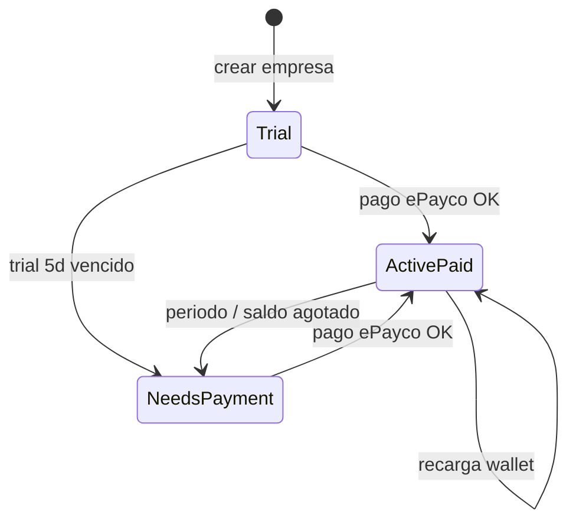

# ePayco + wallet + planes — WPF Dashboard

Cobertura comercial del white label WPF: cómo el admin recarga el plan y cómo el backend contabiliza saldo / viajes.

## Catálogo de planes (UI)

| Id | Nombre | Rol |
|----|--------|-----|
| 0 | Trial interno | Alta / prueba 5 días |
| 1 | Starter | Alta forzada + recarga self-serve |
| 2 | Growth | Recarga self-serve |
| 3 | Business | Recarga self-serve |
| 4 | Enterprise | Contactar ventas |

Precios override por env: `VITE_P2L_PLAN_*_WPF`.

## Wallet en el dashboard

- Sección **Wallet: recarga tu plan** en `CompanyWpfDashboardView`.
- Muestra saldo COP, costo por viaje y viajes restantes estimados.
- Checkout ePayco embebido scoped al tenant `p2l-wpf`.
- Endpoints backend típicos:
  - `/api/p2l-wpf/epayco/confirmation`
  - `/api/p2l-wpf/epayco/return`

## Ciclo de vida de suscripción

1. **Trial** — cupos del plan elegido; banner con días restantes y max conductores.
2. **Needs ePayco** — banner “tu prueba terminó” o renovación; servicio inactivo hasta pago.
3. **Paid** — renovación ~30 días; recargas suman capacidad / wallet según reglas del servicio `p2lWpfCompanyService`.

## Relación con BAAS multi-tenant

- Misma fábrica de company service que otros white labels (unidades / WPF), con textos y URLs ePayco parametrizados.
- Config tenant: `modelos_back/tenants/tenants.config.js` → `p2l-wpf`.
- El panel web **no** factura el mapa Waze ni SQL Server local: solo licencia API + cupos P2L.

## Checklist de cobertura

- [x] Cards de planes en alta y en recarga
- [x] Banners trial / pago
- [x] Contadores de viajes del día vs cupo
- [x] Checkout ePayco scoped WPF
- [ ] Enterprise self-serve (fuera de alcance: contacto ventas)
