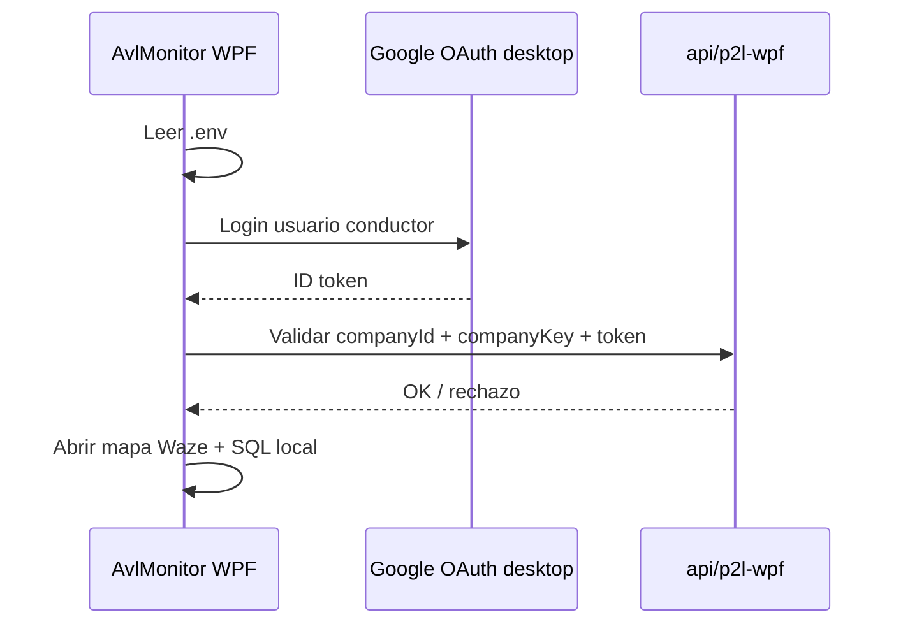

# AvlMonitor · licencia .env

El escritorio es el producto de mapa; el dashboard Vue emite la licencia. Este plan documenta el acoplamiento.

## Roles

| Capa | Responsabilidad |
|------|-----------------|
| Web `CompanyWpfDashboardView` | Empresa, wallet, miembros Gmail, plantilla `.env` |
| API `/api/p2l-wpf` | Validar licencia (Google ID token + companyId + companyKey) |
| AvlMonitor (.NET WPF) | Gate de arranque, mapa Waze (WebView2), SQL Server local |

## Plantilla `.env` (escritorio)

El botón **Copiar plantilla .env** del dashboard genera variables del estilo:

- `P2L_COMPANY_ID`
- `P2L_COMPANY_KEY` (solo visible one-shot en web)
- Endpoint / API base del tenant WPF
- Flags de licencia (`SkipLicenseGate` solo para desarrollo)

El admin pega el `.env` junto al ejecutable / config del cliente.

## Gate de licencia (arranque WPF)

Si `SkipLicenseGate` es false:

1. Exige `.env` válido.
2. Exige Google del usuario (debe estar en miembros de la compañía).
3. Valida licencia contra API P2L WPF antes de abrir el mapa.

## Arquitectura AvlMonitor (resumen)

- `AvlMonitor.Domain` / `Application` / `Infrastructure` / `Persistence` / `UI.Wpf`
- Mapa: iframe Waze Live Map vía WebView2
- Datos locales: SQL Server + Dapper (direcciones, vehículos, simulación AVL)
- Infra: `IP2lLicenseClient`, OAuth Google escritorio, geocoding Geoapify

Fuentes: README y `GUIA_INSTALACION.md` del repo AvlMonitor en la carpeta Marco del monorepo.

## Qué NO cubre el dashboard web

- No embebe el mapa AVL.
- No administra el SQL Server del cliente.
- Solo habilita quién puede abrir el escritorio y con qué cupos/plan.
