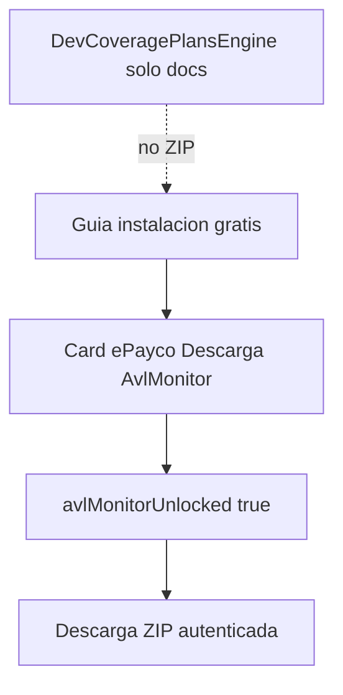

# Producto digital AvlMonitor (dashboard WPF)

## Qué es gratis vs qué se paga

| Recurso | Dónde | Costo |
|---------|-------|-------|
| `GUIA_INSTALACION.md` | Dashboard `/dashboard-wpf` + visor DevCoveragePlansEngine | **Gratis** |
| Plantilla `.env` | Dashboard (copiar) | **Gratis** |
| `AvlMonitor.zip` | Solo dashboard, API autenticada tras ePayco | **Pago** |
| ZIP en DevCoveragePlansEngine | — | **Nunca** (solo documentación) |

## Dinámica de usuario

1. Admin entra con Google a `/login/dashboard-wpf`.
2. Crea empresa (trial).
3. Lee la guía de instalación gratis en el panel.
4. Ve **una sola card de pago**: «Descarga del AvlMonitor».
5. Paga con ePayco (plan 1 / producto digital).
6. Backend marca `avlMonitorUnlocked: true`.
7. Aparece **Descargar AvlMonitor.zip** (`GET /api/p2l-wpf/companies/:id/avl-monitor-download`).

## Implementación

- ZIP en servidor: `modelos_back/assets/p2l-wpf/AvlMonitor.zip` (código fuente sin `bin`/`obj`).
- Campo Mongo: `Company.avlMonitorUnlocked`.
- Servicio WPF: `avlMonitorDownloadEnabled: true`.
- Front: `CompanyWpfDashboardView.vue` — sin catálogo multi-plan; una card de producto digital.

## Revisar después

Precios COP / env `P2L_PLAN_1_TOPUP_COP_WPF` y copy comercial de la card se pueden ajustar sin cambiar la regla: **una card = descarga ZIP**.
